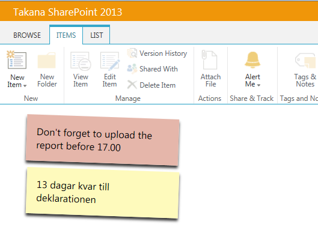

Sample: Rendering Post-it Notes
================

This folder contains a sample list view display template that shows how the default rendering behaviour of the Person or Group field can be recreated in your custom templates.

__csr_ovr_postit.js__  | This template shows Post-it notes. The JSLink should be added to a view.

This sample was created with a specific set of fields in a custom list in mind:

__Title__ | Built-in Title field
__PostitColor__ | Optional field for overriding the default Yellow background of post-it notes
__PostitShow__ | A field for filtering post-it notes to show (used only in the view).

## Future improvements
- Responsive Design
- Ability to select an item and work with it from the Ribbon
