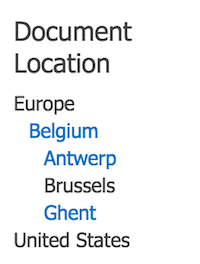
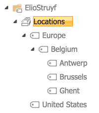

# Managed metadata refiner

This display template is developed to render the hierarchy of the given term set.



The term set looks as follows:



## File(s)

File | Description
--- | ---
__Filter_ManagedMetadata_Label.html__ | This is the managed metadata refiner display template. **Important**: this template is created to be used in combination with the label value of the term, not the taxId.
__filter_mm.css___ | This is the required css file for styling the managed metadata hierarchy.

## Configuration

If you want to make use of these templates, you will have to go through the following configuration steps:

- Open the HTML display template and find the CSS reference: `$includeCSS('this.url', '~sitecollection/_catalogs/masterpage/MMRefiner/filter_mm.css');`
- Validate the CSS reference, if the location is different on your environment, update it to your location
- In the file you will find the following variables that need some configuration:

```javascript
termStoreName = '<Term-Store-Name-OPTIONAL>',
termSetId = '<Term-Set-ID>',
```

- **termStoreName**: this property is optional. By default, it will take the default keyword term store. If you need, you can uncomment the following lines of code so that you can specify the term store by its name:

```javascript
// Get all term stores
// var termStores = taxSession.get_termStores();
// Name of the Term Store from which to get the Terms.
// var termStore = termStores.getByName(termStoreName);
```

- **termSetId**: for this property, you need to fill in the ID of the term set. You can find it at the bottom of the term set page:


- Once you did these configuration steps, you can upload the file to your master page gallery and use it.

### Optional: Showing or hiding terms that cannot be refined

By default the templates renders the complete term set hierarchy. If you want to only show the terms that can be filtered on, you have to uncomment the following lines in the CSS file:

```css
/*.term {
	display: none;
}

.term.show {
	display: block;
}*/
```

This results in:


